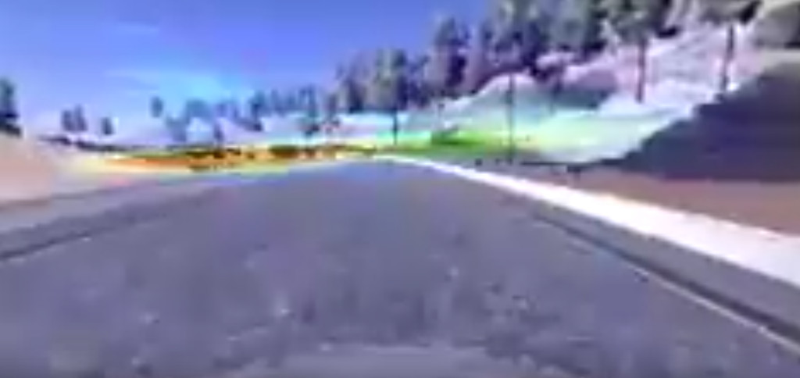

# Convolutional Neural Network Visualization

Just because some network accomplishes some classification, regression,
segmentation or other task does not mean that it is understood how 
it does it.  It just means that the training worked pretty much as
expected, and maybe that we interpretted some key metrics, such as accuracy
or loss, in a manner that makes some sense to us.  Visualizing regions
that have significant impact on the result of a network can help us
learn more about how it interprets the features we present to it.

This repository is motivated primarily by the paper 
[Visualizing and Understanding Convolutional Networks](https://arxiv.org/pdf/1311.2901.pdf)
by Zeiler and Fergus, but also by related papers, such as
[Grad-CAM: Why Did You Say That? Visual Explanations from Deep Networks via Gradient-based Localization](https://arxiv.org/pdf/1610.02391v1.pdf).  It is also inspired by 
[Visualizations for Regressing Wheel Steering Angles in Self Driving Cars](https://jacobgil.github.io/deeplearning/vehicle-steering-angle-visualizations).  The model and weights for this project are based
on a variant of what is available at my 
[Behavior Cloning](https://github.com/ColinShaw/python-behavior-cloning-simulator)
repository.  Indeed, that code was slightly modified for larger images and 
was used for the model in this project.

The idea is that if you evaluate the model with some feature you would
get some resulting angle (for the regressive steering angle problem).
One way to identify the regions of the feature that contribute most to
the result is to simply go over the feature with a sliding window that
is set to zero and see what the deviation is in the resulting angle. 
Those areas that do not change the result are not important to the model,
those that do are.  These results are then scaled, color-mapped and 
used as an overlay to depict these regions of interest on the feature.
This can be done over an entire collection of features to make a video.

The training that I performed was adequate to get the car to go down
the track, but was minimal and the driving was a bit jerky.  The
data it was trained on was the curated feature set available from
Udacity.  You can see what the model was in `models.py`.  I found that
the sub-default learning rate of `1.0e-4` worked best, as the default
rate tended to not train well.  Using `he_normal` initialization for the fully-connected
part of the network worked better, but `glorot_normal` initialization
for the convolutional layers worked best.  Normalizing the features to the
[-1/2, 1/2] interval also trained better.

This takes a _long_ time to run, as for each image there are 1801 
evaluations of the network.  On my GTX 1060, it takes about 8 seconds
per frame, or about 225 network evaluations per second, which is more
than I expected.  The frame data from the video is from me manually 
driving the car around the track, so it is a little shaky. You can
watch `output.mp4` or watch it on [YouTube](https://youtu.be/e7vb43f_ZxM).  The
video is 240x120, so it looks horendous on YouTube.

The results are not quite what I would have expected.  One would think 
that the lane borders would be more important to the network.  What 
appears to be the case from the result is that the horizon is the most important,
with occasional other regions.  As noted earlier, the training wasn't that 
great and the car drove shakily at best down the road when driven
automatically.  Of course different amounts of training, hyperparameters, etc.,
could result in significantly different results.  Interestingly, fellow Udacity 
Self-Driving Car student Mengxi Wu, in the Medium article 
[Self-Driving Car in a Simulator with a Tiny Neural Network](https://medium.com/@xslittlegrass/self-driving-car-in-a-simulator-with-a-tiny-neural-network-13d33b871234#.82g84vogz),
also depicts visualization indicative of a network that detects somewhat unexpected
features, though in this case the visualization is of the specific layers
and it is more clear _how_ the network is mutating the features through
the layers.  
